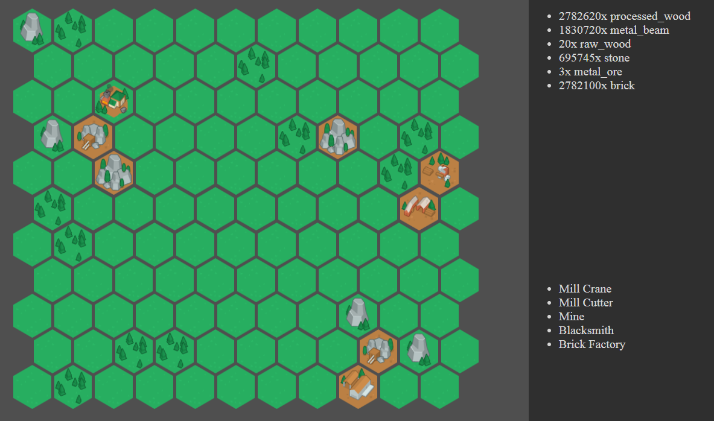

This is a very basic example game made with JavaScript.

The board spawns randomly. The player can build a few different builds to mine and process resources. 

At this time the game is incomplete but, can still serve as a great tool to learn about JavaScript.